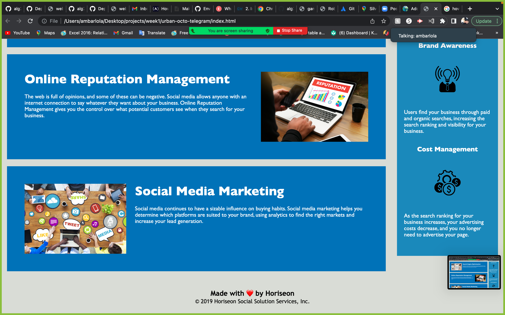
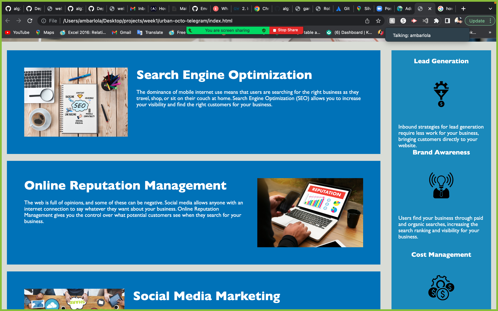

# Code Refactor Starter Code
# 2 Week 1 project addressing accessibility concerns 
In this project the css code was consolidated and html semantic tags were added

The started code was used from the GW webpage and was provided by the class. 

[This is an external link to Horiseon webpage](https://alg22573.github.io/week1/)